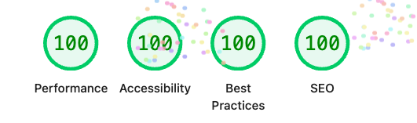

# Flash Flow

A high-throughput flash sale platform built with **Turborepo**, featuring a **NestJS** backend API and a **React 19** web application. Designed to handle thousands of concurrent purchase attempts with atomic stock management.

---

## 🚦 Getting Started

### Prerequisites
- **Node.js** ≥ 20
- **npm** ≥ 11
- **Docker Desktop**

### 1. Simple Start (Recommended)
Run the entire stack including infrastructure, backend, and frontend with a single command:

```bash
# 1. Start all services
docker compose up --build -d

# 2. Push schema and Seed (Critical for first run)
cd apps/backend
npm run db:push
npm run seed
```

### 2. Infrastructure Setup
> [!NOTE]
> Skip this if you used the **Simple Start** (Docker) method. Use this only for local development.

If you prefer running apps locally but infrastructure (Postgres/Redis) in Docker:

```bash
# Start Postgres & Redis
docker compose up -d postgres redis

# Push schema & Seed
cd apps/backend
npm run db:push
npm run seed
```

### 3. Start Development Servers
> [!NOTE]
> Skip this if you used the **Simple Start** (Docker) method.

From the root of the project:

```bash
npm run dev
```

---

## 🏗️ System Architecture

Flash Flow uses a vertically sliced feature-based architecture. To handle traffic spikes without overselling, the system implements a **two-layer concurrency strategy**:

1.  **Redis Stock Gate**: An atomic in-memory counter that rejects excess traffic at O(1) speed.
2.  **PostgreSQL Advisory Locks**: Serialized database transactions that serve as the final source of truth.

> [!TIP]
> Detailed architectural diagrams (Client-Server map, Purchase Flow sequence) are available in the **[Functional Specification Document (FSD)](docs/fsd.md)**.

---

## ⚡ Performance & Quality

Flash Flow is optimized for speed, accessibility, and SEO, achieving a **perfect 100/100 score on all Lighthouse metrics**.



---

## 🚀 API Endpoints

| Method | Endpoint | Description |
|--------|----------|-------------|
| GET | `/api/v1/flash-sales/current` | Get current sale status & stock |
| POST | `/api/v1/flash-sales/current/purchase` | Attempt a purchase (requires `userId`) |
| GET | `/api/v1/flash-sales/current/purchase` | Check purchase status (requires `userId` query param) |

---

## 🧪 Testing

The project maintains **>95% code coverage** for core business logic.

> [!TIP]
> A comprehensive breakdown of our testing methodology, coverage reports, and CI/CD integration is available in the **[Testing Strategy](docs/testing.md)**.

### 1. Automated Tests (Total: 98 tests)

| Command | Scope | Type |
|---------|-------|------|
| `npm run test` | Workspace | Run all unit tests via Turbo |
| `cd apps/backend && npm run test` | Backend | Unit (45 tests) |
| `cd apps/backend && npm run test:watch` | Backend | Watch mode |
| `cd apps/backend && npm run test:cov` | Backend | Coverage report |
| `cd apps/backend && npm run test:e2e` | Backend | E2E + Integration (19 tests) |
| `cd apps/web && npm run test` | Frontend | Unit + Integration (37 tests) |
| `cd apps/web && npm run test:watch` | Frontend | Watch mode |
| `cd apps/web && npm run test:cov` | Frontend | Coverage report |

> [!NOTE]
> E2E and Integration tests for the backend use **Testcontainers** to spin up ephemeral Postgres/Redis. Ensure Docker is running.

### 2. Stress Testing (k6)
Simulate hundreds of concurrent users competing for limited stock.

> [!IMPORTANT]
> **Rate Limiting**: The API enforces a 100 req/min limit. Temporarily increase the `limit` in `apps/backend/src/app.module.ts` before stress testing.
>
> **Rebuilding**: Run `docker compose up --build -d` if you've modified source code while Docker is running.

```bash
# 1. Start infrastructure and seed (add --build if code changed)
docker compose up -d
cd apps/backend && npm run seed

# 2. Run stress test via Docker (Return to root first)
cd ../..
docker run --rm -i --add-host=host.docker.internal:host-gateway \
  grafana/k6 run - < e2e/stress/flash-sale.stress.js

# Alternative: If k6 is installed locally
k6 run -e BASE_URL=http://localhost:3001 e2e/stress/flash-sale.stress.js
```

The script simulates a 3-stage load pattern:
1. **Ramp-up** (0→50 users), 2. **Sustained peak** (200 users), 3. **Cool-down**.

**Expected Outcome:**
- **No Overselling**: Total purchases exactly match available stock.
- **Idempotency**: One user gets exactly one success even if they spam requests.
- **Performance**: p95 response time < 100ms.
- **Graceful Failure**: Users who miss out receive a friendly `409 SOLD_OUT` modal.

---

## 🛠️ Tech Stack

- **Monorepo**: [Turborepo](https://turborepo.dev/)
- **Backend**: [NestJS 11](https://nestjs.com/) · Express · Node.js ≥ 20
- **Frontend**: [React 19](https://react.dev/) · [TanStack Start](https://tanstack.com/start)
- **Database**: [PostgreSQL 16](https://www.postgresql.org/) ([Prisma 7](https://www.prisma.io/))
- **Cache**: [Redis 7](https://redis.io/)
- **Testing**: [Vitest](https://vitest.dev/) · [Testcontainers](https://testcontainers.com/)

---

## 🧠 Design Choices & Trade-offs

| Decision | Rationale | Trade-off |
| -------- | --------- | --------- |
| **Redis Stock Gate** | Atomic O(1) in-memory counter rejects excess traffic instantly, protecting PostgreSQL from the "Thundering Herd". | **Distributed State**: Requires rollback logic (`INCR`) to remain eventually consistent if database writes fail. |
| **Advisory Locks** | Serializes concurrent purchase attempts for the same user without locking the entire `flash_sales` table. | **DB Specificity**: Advisory locks are a PostgreSQL-specific feature, limiting database portability. |
| **Vertical Slicing** | Business logic organized by feature (`flash-sale/`) rather than technical layer (Service/Repo) for better modularity. | **Interface Rigidity**: Requires strict public API boundaries between features to prevent circular dependencies. |
| **Unified Envelope** | Global interceptors/filters ensure a standard response shape for all success and error paths. | **Boilerplate**: Adds slight abstraction overhead and requires a consistent mapping for all feature-level errors. |
| **Modal Error UI** | High-impact feedback for critical system failures (429, 409) ensures users don't miss important state changes. | **Interruptive**: Modals block interaction, which can be frustrating if triggered frequently. |

---

## 📂 Documentation Links

- **[Functional Spec (FSD)](docs/fsd.md)**: Deep dive into architecture and models.
- **[Testing Strategy](docs/testing.md)**: Detailed test counts, coverage reports, and CI/CD setup.
