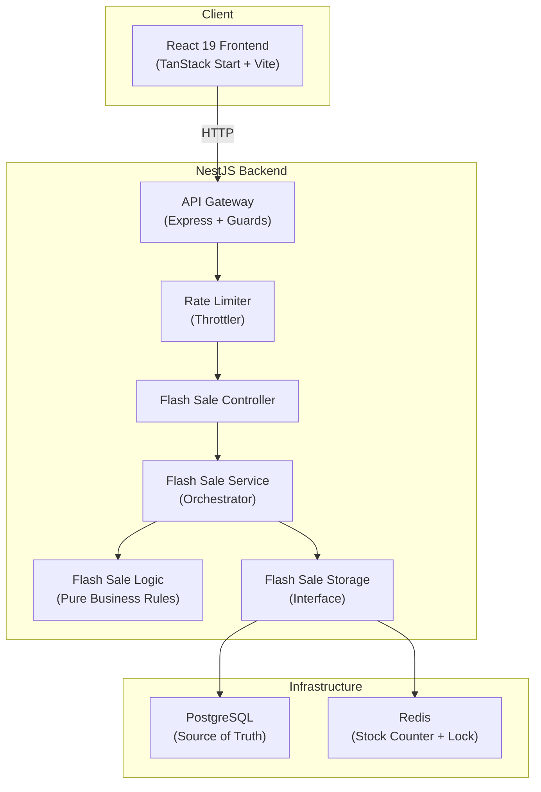
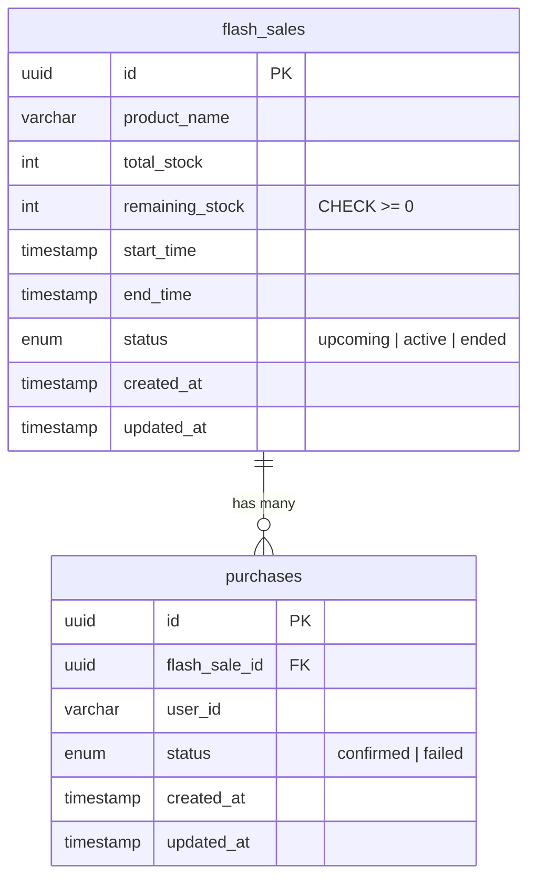
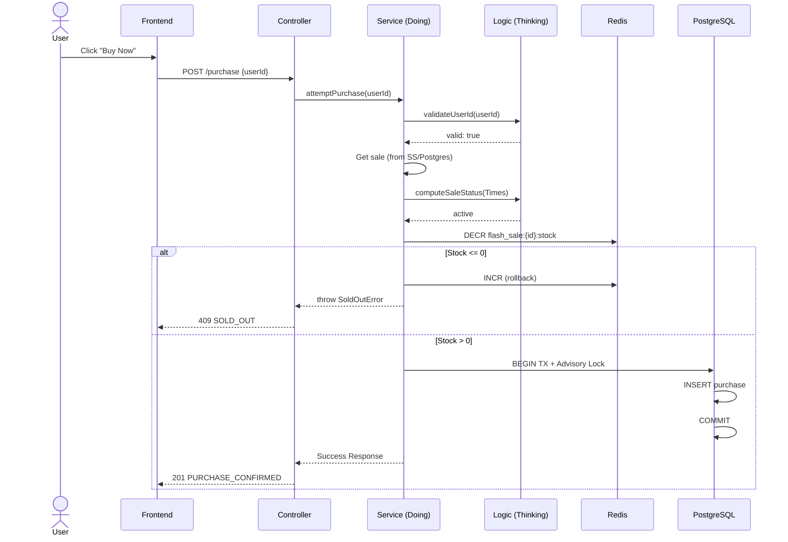

# Functional Specification Document — Flash Sale System

**Project:** Flash Flow  
**Date:** 2026-02-23  
**Status:** Draft

---

## 1. Overview

A high-throughput flash sale platform for a **single product with limited stock**. The system handles thousands of concurrent purchase attempts during a defined sale window, enforces **one item per user**, prevents overselling, and provides real-time sale status feedback.

---

## 2. System Architecture



### Concurrency Strategy

The critical path — **decrement stock + record purchase** — uses a **two-layer approach**:

1. **Redis atomic decrement** (`DECR`) as a fast, in-memory stock gate. If the counter reaches 0, all subsequent requests are rejected instantly without touching the database.
2. **PostgreSQL advisory lock + transaction** for the actual purchase record. This is the source of truth and ensures no overselling even if Redis is slightly out of sync.

This means Redis absorbs the traffic spike (O(1) reject for sold-out), while PostgreSQL only handles the successful purchase writes.

---

## 3. Domain Models



> **Constraints:**
> - `purchases(flash_sale_id, user_id)` has a **UNIQUE** index — enforces one purchase per user per sale
> - `flash_sales.remaining_stock` has a **CHECK ≥ 0** constraint — database-level oversell prevention

### 3.1 Flash Sale

| Field        | Type        | Description                            |
| ------------ | ----------- | -------------------------------------- |
| `id`         | UUID        | Primary key                            |
| `product_name` | string    | Name of the product                    |
| `total_stock`  | integer   | Total items available                  |
| `remaining_stock` | integer | Current remaining count              |
| `start_time`   | timestamp | Sale opens                             |
| `end_time`     | timestamp | Sale closes                            |
| `status`       | enum      | `upcoming` \| `active` \| `ended`     |
| `created_at`   | timestamp | Record creation                        |
| `updated_at`   | timestamp | Last modification                      |

### 3.2 Purchase

| Field          | Type      | Description                            |
| -------------- | --------- | -------------------------------------- |
| `id`           | UUID      | Primary key                            |
| `flash_sale_id`| UUID      | FK → `flash_sales.id`                 |
| `user_id`      | string    | User identifier (email/username)       |
| `status`       | enum      | `confirmed` \| `failed`               |
| `created_at`   | timestamp | Purchase time                          |
| `updated_at`   | timestamp | Last modification                      |

**Constraints:**
- `UNIQUE(flash_sale_id, user_id)` — enforces one purchase per user per sale
- `CHECK(remaining_stock >= 0)` — database-level oversell prevention

---

## 4. API Specification

Base path: `/api/v1`

### 4.1 Get Sale Status

```
GET /api/v1/flash-sales/current
```

**Response (200):**
```json
{
  "data": {
    "id": "uuid",
    "productName": "Limited Edition Widget",
    "totalStock": 100,
    "remainingStock": 42,
    "startTime": "2026-02-24T10:00:00Z",
    "endTime": "2026-02-24T10:30:00Z",
    "status": "active"
  }
}
```

**Business logic:**
- `status` is computed from `start_time`/`end_time` vs current server time
- `remainingStock` is read from Redis (fast path) with DB fallback

---

### 4.2 Attempt Purchase

```
POST /api/v1/flash-sales/current/purchase
```

**Request body:**
```json
{
  "userId": "user@example.com"
}
```

**Responses:**

| Status | Code | Condition |
| ------ | ---- | --------- |
| 201    | `PURCHASE_CONFIRMED` | Purchase successful |
| 409    | `ALREADY_PURCHASED` | User already bought an item |
| 409    | `SOLD_OUT` | No stock remaining |
| 409    | `SALE_NOT_ACTIVE` | Sale hasn't started or already ended |
| 400    | `VALIDATION_ERROR` | Missing or invalid user identity |
| 429    | `RATE_LIMIT_EXCEEDED` | Too many requests (custom throttler) |

**Success (201):**
```json
{
  "data": {
    "purchaseId": "uuid",
    "userId": "user@example.com",
    "productName": "Limited Edition Widget",
    "status": "confirmed",
    "purchasedAt": "2026-02-24T10:00:05Z"
  }
}
```

**Error (409/429):**
```json
{
  "status": "error",
  "error": {
    "code": "RATE_LIMIT_EXCEEDED",
    "message": "Slow down! You are making too many requests. Please wait a moment.",
    "correlationId": "req-abc123"
  }
}
```
> **Note:** All errors are standardized via `HttpExceptionFilter` and `TransformInterceptor`.

---

### 4.3 Check User Purchase

```
GET /api/v1/flash-sales/current/purchase?userId=user@example.com
```

**Response (200) — Purchased:**
```json
{
  "data": {
    "purchased": true,
    "purchaseId": "uuid",
    "purchasedAt": "2026-02-24T10:00:05Z"
  }
}
```

**Response (200) — Not purchased:**
```json
{
  "data": {
    "purchased": false
  }
}
```

---

## 5. Purchase Flow (Critical Path)



### 5.1 Why this ordering matters

1. **Redis Gate** — The `FlashSaleService` decrements Redis *before* starting any DB transaction. This acts as an O(1) fast-rejection layer that protects the PostgreSQL instance from 99% of the load during a massive traffic spike.
2. **Safety Rollback** — If the `FlashSaleStorage` (Postgres) throws an error (e.g., duplicate user or generic DB failure), the Service immediately calls `INCR` on Redis to restore the global stock counter, ensuring eventual consistency between the cache and source-of-truth.
3. **Advisory Lock** — Inside the PostgreSQL transaction, we acquire a `pg_advisory_xact_lock` hashed to the `saleId`. This ensures that even if two requests for the same user pass the Redis gate at the exact same millisecond, they are strictly serialized at the database level.
4. **The "Rugged" Check** — Even if all higher-level logic fails, the database schema includes a `CHECK (remaining_stock >= 0)` constraint as the absolute final line of defense against overselling.

---

## 6. Feature Module Structure

Following the project's feature-based organization:

```
apps/backend/
├── src/
│   ├── platform/
│   │   ├── database/         # Prisma setup
│   │   ├── redis/            # Redis client setup
│   │   ├── throttler/        # Custom CustomThrottlerGuard
│   │   ├── server/           # HttpExceptionFilter, TransformInterceptor
│   │   └── logger/           # Structured logger
│   ├── features/
│   │   └── flash-sale/
│   │       ├── flash-sale.module.ts
│   │       ├── flash-sale.controller.ts        # HTTP handlers
│   │       ├── flash-sale.controller.spec.ts   # Controller tests (mock service)
│   │       ├── flash-sale.logic.ts             # Pure business rules
│   │       ├── flash-sale.logic.spec.ts        # Unit tests (no I/O)
│   │       ├── flash-sale.service.ts           # Service (orchestrates logic + storage)
│   │       ├── flash-sale.storage.ts           # Storage interface
│   │       ├── flash-sale.storage.pg.ts        # PostgreSQL implementation
│   │       ├── flash-sale.storage.redis.ts     # Redis implementation
│   │       ├── flash-sale.storage.mock.ts      # Mock for unit tests
│   │       ├── flash-sale.storage.integration.spec.ts
│   │       ├── flash-sale.models.ts            # Domain types, DTOs
│   │       └── flash-sale.errors.ts            # Feature-specific errors
│   └── main.ts
```

```
apps/web/
├── src/
│   ├── features/
│   │   └── flash-sale/
│   │       ├── components/
│   │       │   ├── SaleStatus.tsx
│   │       │   ├── PurchaseButton.tsx
│   │       │   └── PurchaseResult.tsx
│   │       ├── api/
│   │       │   ├── flash-sale.api.ts           # Interface
│   │       │   └── flash-sale.api.backend.ts   # Fetch implementation
│   │       ├── types/
│   │       │   └── flash-sale.types.ts
│   │       └── index.ts
│   └── routes/
│       └── index.tsx                            # Sale page
```

---

## 7. Business Rules (Pure Functions)

The system enforces a strict separation between **Thinking** (logic/decisions) and **Doing** (I/O orchestration). 

- **Thinking (`flash-sale.logic.ts`)**: Side-effect free pure functions. They are deterministic, making them instantly testable across infinite edge cases without a database or Redis.
- **Doing (`flash-sale.service.ts`)**: Orchestrates the state. It handles database transactions, Redis gates, and logging but delegates all business "decisions" to the logic layer.

### 7.1 Pure Logic Inventory

| Function | Input | Output | Description |
| -------- | ----- | ------ | ----------- |
| `computeSaleStatus` | `startTime, endTime, now` | `upcoming \| active \| ended` | Derives status from time |
| `canAttemptPurchase` | `saleStatus, remainingStock, hasExistingPurchase` | `{ allowed: boolean, reason?: string }` | Pre-validates a purchase attempt |
| `validateUserId` | `userId: string` | `{ valid: boolean, errors: string[] }` | Input validation |

---

## 8. Testing Strategy

### 8.1 Unit Tests (Vitest — Backend)

| What | How |
| ---- | --- |
| `flash-sale.logic.spec.ts` | Pure function tests — `computeSaleStatus`, `canAttemptPurchase`, edge cases |
| `flash-sale.controller.spec.ts` | Mock service, test HTTP status codes and response shapes |
| `flash-sale.service.spec.ts` | Mock storage, test orchestration (Redis decrement → DB write → rollback) |

**Run:** `cd apps/backend && npm test`

### 8.2 Integration Tests (Testcontainers)

| What | How |
| ---- | --- |
| `flash-sale.storage.integration.spec.ts` | Real PostgreSQL via Testcontainers — unique constraint, CHECK constraint, advisory locks |
| Redis integration | Real Redis via Testcontainers — atomic DECR/INCR behavior |

**Run:** `cd apps/backend && npm run test:e2e`

### 8.3 Stress Tests

Simulate high concurrency to prove:
- **No overselling** — N concurrent requests for M items (M < N) results in exactly M purchases
- **Graceful degradation** — After stock runs out, all requests get `409 SOLD_OUT` instantly
- **One per user** — same user sending multiple requests gets only one purchase
- **Performance** — p99 latency under load

**Tool:** [k6](https://k6.io/) or [autocannon](https://github.com/mcollina/autocannon)

```
k6/
├── flash-sale-stress.js        # Main stress test script
└── flash-sale-spike.js         # Spike test (sudden burst)
```

**Scenarios:**
1. **Ramp-up:** 0 → 1000 VUs over 30s, 100 stock items → assert exactly 100 confirmed
2. **Spike:** 500 VUs instant burst, 50 stock items → assert exactly 50 confirmed
3. **Duplicate user:** 100 VUs same userId → assert exactly 1 confirmed

---

## 9. Infrastructure (Local Development)

```yaml
# docker-compose.yml
services:
  postgres:
    image: postgres:16-alpine
    ports: ["5432:5432"]
    environment:
      POSTGRES_DB: flash_flow
      POSTGRES_USER: flash
      POSTGRES_PASSWORD: flash

  redis:
    image: redis:7-alpine
    ports: ["6379:6379"]
```

**Cloud-ready design:** The storage interfaces allow swapping PostgreSQL for any SQL database, and Redis for any KV store with atomic operations (e.g., Memorystore, ElastiCache).

---

## 10. Key Design Decisions & Trade-offs

| Decision | Rationale | Trade-off (The Cost) |
| -------- | --------- | -------------------- |
| **Redis as Stock Gate** | **O(1)** rejection for sold-out state; prevents "Thundering Herd" on the primary DB. | **Complexity & Consistency:** Introduces a distributed state problem. If Redis decrements but the DB write fails, you need a reliable compensation mechanism (rollback/re-increment) or reconciliation job. |
| **Standardized Responses** | Interceptor + Filter ensure unified response shape (`data` for success, partitioned `error` object for failures) for all endpoints. | **Rigidity:** Adds abstraction overhead. Simple endpoints require the same wrapper boilerplate, and it can sometimes obscure native HTTP error semantics if not careful. |
| **Modal Error Popups** | High-impact UI ensures critical failures (e.g., 429 Too Many Requests, Network Errors) aren't missed. | **Intrusive UX:** Modals block the user interface and require a click to dismiss, which can be frustrating if errors are frequent (e.g., during a spam-click scenario). |
| **Friendly Mapping** | Maps technical error codes (e.g., `SOLD_OUT`) to user-friendly messages like "Too late! Sold out" on the client. | **Client-Server Coupling:** The frontend must maintain a mapping of backend error codes. If the backend introduces a new code, the frontend needs a deployment to handle it gracefully. |

---

## 11. Error Handling & UI Patterns

### 11.1 Backend Standardization
The system uses a **Standardized Response Envelope**:
- **Success (2xx)**: `{ status: "success", data: T }`
- **Error (4xx/5xx)**: `{ status: "error", error: { code, message, correlationId } }`

This is implemented via:
1. `TransformInterceptor`: Automatically wraps valid responses.
2. `HttpExceptionFilter`: Catches all exceptions, handles field-level validation errors, and attaches `correlationId`.

### 11.2 Frontend Error UX
Errors follow a strict hierarchy based on impact:
1. **Critical Failures (Modal)**: System-wide or action-blocking errors (Network failure, Rate limit, Sold out) trigger a high-impact modal popup with a clear recovery action (e.g., "Try Again" or "Reload System").
2. **Input Validation (Inline)**: Minor input errors (e.g., "Identity too short") are displayed inline above the input field to maintain focus.

### 11.3 Rate Limiting UX
When `RATE_LIMIT_EXCEEDED` is received:
1. The backend returns a custom 429 with a friendly message.
2. The frontend triggers the `PurchaseResult` modal in "Action Failed" mode.
3. The UI shows a "System automatically recovering..." hint.
