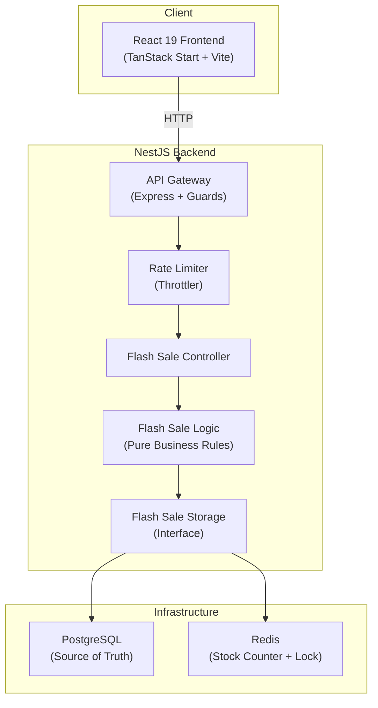
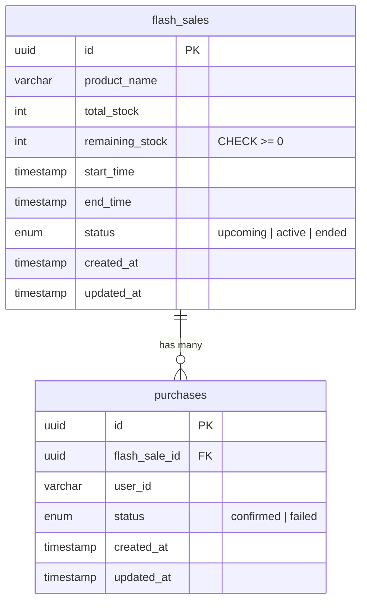
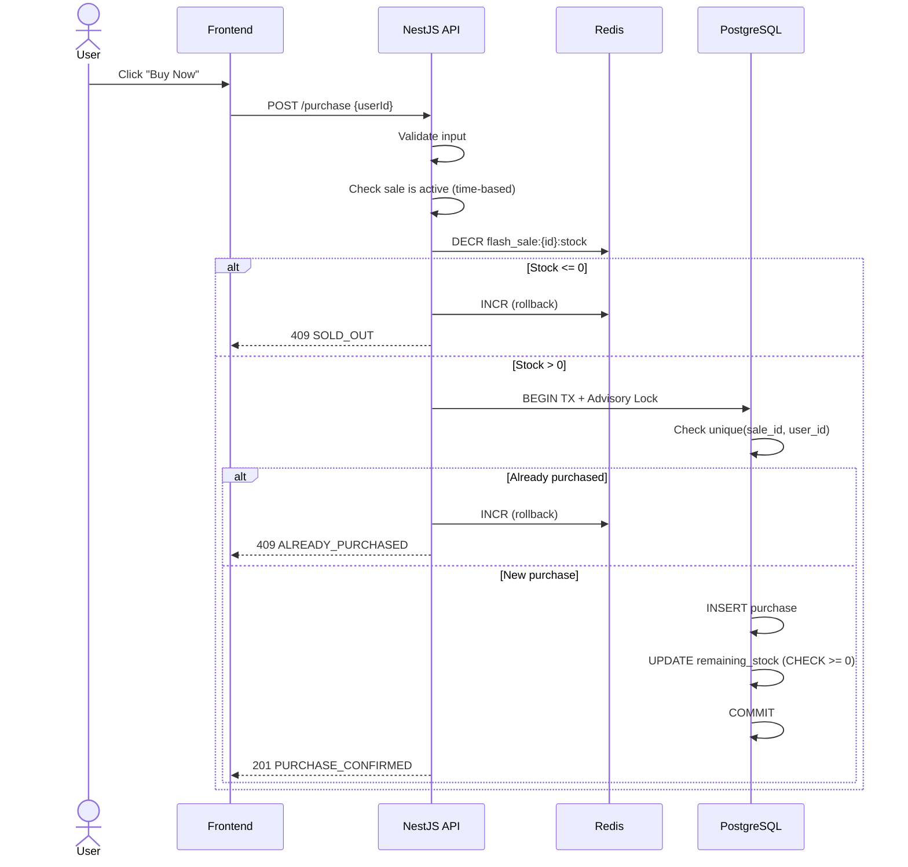

# Functional Specification Document — Flash Sale System

**Project:** Flash Flow  
**Date:** 2026-02-23  
**Status:** Draft

---

## 1. Overview

A high-throughput flash sale platform for a **single product with limited stock**. The system handles thousands of concurrent purchase attempts during a defined sale window, enforces **one item per user**, prevents overselling, and provides real-time sale status feedback.

---

## 2. System Architecture



### Concurrency Strategy

The critical path — **decrement stock + record purchase** — uses a **two-layer approach**:

1. **Redis atomic decrement** (`DECR`) as a fast, in-memory stock gate. If the counter reaches 0, all subsequent requests are rejected instantly without touching the database.
2. **PostgreSQL advisory lock + transaction** for the actual purchase record. This is the source of truth and ensures no overselling even if Redis is slightly out of sync.

This means Redis absorbs the traffic spike (O(1) reject for sold-out), while PostgreSQL only handles the successful purchase writes.

---

## 3. Domain Models



> **Constraints:**
> - `purchases(flash_sale_id, user_id)` has a **UNIQUE** index — enforces one purchase per user per sale
> - `flash_sales.remaining_stock` has a **CHECK ≥ 0** constraint — database-level oversell prevention

### 3.1 Flash Sale

| Field        | Type        | Description                            |
| ------------ | ----------- | -------------------------------------- |
| `id`         | UUID        | Primary key                            |
| `product_name` | string    | Name of the product                    |
| `total_stock`  | integer   | Total items available                  |
| `remaining_stock` | integer | Current remaining count              |
| `start_time`   | timestamp | Sale opens                             |
| `end_time`     | timestamp | Sale closes                            |
| `status`       | enum      | `upcoming` \| `active` \| `ended`     |
| `created_at`   | timestamp | Record creation                        |
| `updated_at`   | timestamp | Last modification                      |

### 3.2 Purchase

| Field          | Type      | Description                            |
| -------------- | --------- | -------------------------------------- |
| `id`           | UUID      | Primary key                            |
| `flash_sale_id`| UUID      | FK → `flash_sales.id`                 |
| `user_id`      | string    | User identifier (email/username)       |
| `status`       | enum      | `confirmed` \| `failed`               |
| `created_at`   | timestamp | Purchase time                          |
| `updated_at`   | timestamp | Last modification                      |

**Constraints:**
- `UNIQUE(flash_sale_id, user_id)` — enforces one purchase per user per sale
- `CHECK(remaining_stock >= 0)` — database-level oversell prevention

---

## 4. API Specification

Base path: `/api/v1`

### 4.1 Get Sale Status

```
GET /api/v1/flash-sales/current
```

**Response (200):**
```json
{
  "data": {
    "id": "uuid",
    "productName": "Limited Edition Widget",
    "totalStock": 100,
    "remainingStock": 42,
    "startTime": "2026-02-24T10:00:00Z",
    "endTime": "2026-02-24T10:30:00Z",
    "status": "active"
  }
}
```

**Business logic:**
- `status` is computed from `start_time`/`end_time` vs current server time
- `remainingStock` is read from Redis (fast path) with DB fallback

---

### 4.2 Attempt Purchase

```
POST /api/v1/flash-sales/current/purchase
```

**Request body:**
```json
{
  "userId": "user@example.com"
}
```

**Responses:**

| Status | Code | Condition |
| ------ | ---- | --------- |
| 201    | `PURCHASE_CONFIRMED` | Purchase successful |
| 409    | `ALREADY_PURCHASED` | User already bought an item |
| 409    | `SOLD_OUT` | No stock remaining |
| 409    | `SALE_NOT_ACTIVE` | Sale hasn't started or already ended |
| 400    | `VALIDATION_ERROR` | Missing or invalid `userId` |
| 429    | `RATE_LIMITED` | Too many requests |

**Success (201):**
```json
{
  "data": {
    "purchaseId": "uuid",
    "userId": "user@example.com",
    "productName": "Limited Edition Widget",
    "status": "confirmed",
    "purchasedAt": "2026-02-24T10:00:05Z"
  }
}
```

**Error (409):**
```json
{
  "status": "error",
  "code": 409,
  "error": {
    "code": "SOLD_OUT",
    "message": "All items have been sold.",
    "correlationId": "req-abc123"
  }
}
```

---

### 4.3 Check User Purchase

```
GET /api/v1/flash-sales/current/purchase?userId=user@example.com
```

**Response (200) — Purchased:**
```json
{
  "data": {
    "purchased": true,
    "purchaseId": "uuid",
    "purchasedAt": "2026-02-24T10:00:05Z"
  }
}
```

**Response (200) — Not purchased:**
```json
{
  "data": {
    "purchased": false
  }
}
```

---

## 5. Purchase Flow (Critical Path)



### Why this ordering matters

1. **Redis first** — filters out the vast majority of requests (sold-out fast rejection) at O(1) cost
2. **DECR then DB** — if the DB operation fails, we `INCR` Redis to restore the counter
3. **Advisory lock** — prevents race conditions between the uniqueness check and the insert
4. **DB CHECK constraint** — final safety net against negative stock (defense-in-depth)

---

## 6. Feature Module Structure

Following the project's feature-based organization:

```
apps/backend/
├── src/
│   ├── platform/
│   │   ├── database/         # TypeORM/Prisma setup, connection
│   │   ├── redis/            # Redis client setup
│   │   └── logger/           # Structured logger (Pino/Winston)
│   ├── features/
│   │   └── flash-sale/
│   │       ├── flash-sale.module.ts
│   │       ├── flash-sale.controller.ts        # HTTP handlers
│   │       ├── flash-sale.controller.spec.ts   # Controller tests (mock service)
│   │       ├── flash-sale.logic.ts             # Pure business rules
│   │       ├── flash-sale.logic.spec.ts        # Unit tests (no I/O)
│   │       ├── flash-sale.service.ts           # Service (orchestrates logic + storage)
│   │       ├── flash-sale.storage.ts           # Storage interface
│   │       ├── flash-sale.storage.pg.ts        # PostgreSQL implementation
│   │       ├── flash-sale.storage.redis.ts     # Redis implementation
│   │       ├── flash-sale.storage.mock.ts      # Mock for unit tests
│   │       ├── flash-sale.storage.integration.spec.ts
│   │       ├── flash-sale.models.ts            # Domain types, DTOs
│   │       └── flash-sale.errors.ts            # Feature-specific errors
│   └── main.ts
```

```
apps/web/
├── src/
│   ├── features/
│   │   └── flash-sale/
│   │       ├── components/
│   │       │   ├── SaleStatus.tsx
│   │       │   ├── PurchaseButton.tsx
│   │       │   └── PurchaseResult.tsx
│   │       ├── api/
│   │       │   ├── flash-sale.api.ts           # Interface
│   │       │   └── flash-sale.api.backend.ts   # Fetch implementation
│   │       ├── types/
│   │       │   └── flash-sale.types.ts
│   │       └── index.ts
│   └── routes/
│       └── index.tsx                            # Sale page
```

---

## 7. Business Rules (Pure Functions)

These live in `flash-sale.logic.ts` with zero I/O dependencies:

| Function | Input | Output | Description |
| -------- | ----- | ------ | ----------- |
| `computeSaleStatus` | `startTime, endTime, now` | `upcoming \| active \| ended` | Derives status from time |
| `canAttemptPurchase` | `saleStatus, remainingStock, hasExistingPurchase` | `{ allowed: boolean, reason?: string }` | Pre-validates a purchase attempt |
| `validateUserId` | `userId: string` | `{ valid: boolean, errors: string[] }` | Input validation |

---

## 8. Testing Strategy

### 8.1 Unit Tests (Jest — Backend)

| What | How |
| ---- | --- |
| `flash-sale.logic.spec.ts` | Pure function tests — `computeSaleStatus`, `canAttemptPurchase`, edge cases |
| `flash-sale.controller.spec.ts` | Mock service, test HTTP status codes and response shapes |
| `flash-sale.service.spec.ts` | Mock storage, test orchestration (Redis decrement → DB write → rollback) |

**Run:** `cd apps/backend && npm test`

### 8.2 Integration Tests (Testcontainers)

| What | How |
| ---- | --- |
| `flash-sale.storage.integration.spec.ts` | Real PostgreSQL via Testcontainers — unique constraint, CHECK constraint, advisory locks |
| Redis integration | Real Redis via Testcontainers — atomic DECR/INCR behavior |

**Run:** `cd apps/backend && npm run test:e2e`

### 8.3 Stress Tests

Simulate high concurrency to prove:
- **No overselling** — N concurrent requests for M items (M < N) results in exactly M purchases
- **One per user** — same user sending multiple requests gets only one purchase
- **Performance** — p99 latency under load

**Tool:** [k6](https://k6.io/) or [autocannon](https://github.com/mcollina/autocannon)

```
k6/
├── flash-sale-stress.js        # Main stress test script
└── flash-sale-spike.js         # Spike test (sudden burst)
```

**Scenarios:**
1. **Ramp-up:** 0 → 1000 VUs over 30s, 100 stock items → assert exactly 100 confirmed
2. **Spike:** 500 VUs instant burst, 50 stock items → assert exactly 50 confirmed
3. **Duplicate user:** 100 VUs same userId → assert exactly 1 confirmed

---

## 9. Infrastructure (Local Development)

```yaml
# docker-compose.yml
services:
  postgres:
    image: postgres:16-alpine
    ports: ["5432:5432"]
    environment:
      POSTGRES_DB: flash_flow
      POSTGRES_USER: flash
      POSTGRES_PASSWORD: flash

  redis:
    image: redis:7-alpine
    ports: ["6379:6379"]
```

**Cloud-ready design:** The storage interfaces allow swapping PostgreSQL for any SQL database, and Redis for any KV store with atomic operations (e.g., Memorystore, ElastiCache).

---

## 10. Key Design Decisions & Trade-offs

| Decision | Rationale | Trade-off |
| -------- | --------- | --------- |
| **Redis as stock gate** | O(1) rejection for sold-out state; protects DB from thundering herd | Extra infra complexity; needs rollback on DB failure |
| **PostgreSQL advisory lock** | Prevents race between check-and-insert without table-level locking | Slightly slower than optimistic locking; simpler correctness |
| **DB CHECK constraint** | Defense-in-depth against negative stock | Minor overhead per write (negligible) |
| **userId as plain string (no auth)** | Project scope simplification; keeps focus on concurrency | No real authentication; easily swappable for JWT later |
| **Computed sale status** | Single source of truth from time; no state drift | Slightly more server-side logic per request |
| **Feature-based modules** | Follows project architecture rules; each feature is a vertical slice | N/A (aligns with existing patterns) |
